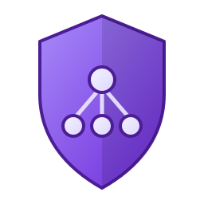
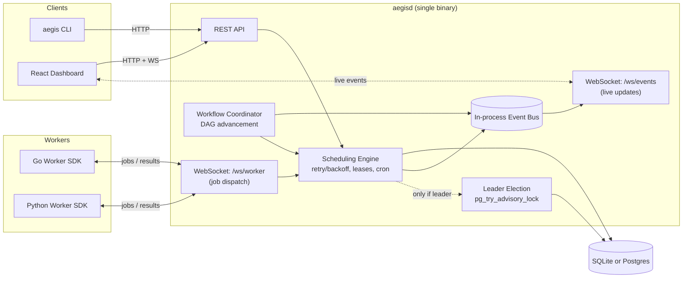

<p align="center">
  
</p>

<h1 align="center">Aegis</h1>
<p align="center"><b>A self-hosted distributed job queue and DAG workflow orchestration engine.</b></p>

<p align="center">
  
  
  
  
</p>

---

Aegis is a from-scratch alternative to Celery / Sidekiq / Temporal for teams
that want a durable job queue and DAG workflow engine without adopting a
managed platform or a Redis + Postgres + separate-orchestrator stack. It runs
as a single static binary with an embedded dashboard, backed by either
zero-config SQLite or Postgres for multi-node HA. It's also built to be
*read*, not just run: the whole engine is a few thousand lines of Go with no
hidden magic.

## Why this exists

Most "build a job queue" toy projects wrap a list in a mutex. Aegis instead
implements the actual hard parts of a production queue:

- **Exactly-once-ish delivery under crash** via row leasing + a background
  reclaim loop, not just "trust the worker."
- **Exponential backoff with full jitter** (the AWS Architecture Blog
  algorithm) instead of naive fixed-delay retries that cause retry storms.
- **A real DAG engine**: fan-out, fan-in, cycle detection, and reactive
  (event-driven, not polling) step advancement, not just a linear chain.
- **Leader election** (Postgres advisory locks) so you can run multiple
  server replicas and have scheduling fail over automatically if the leader
  dies, without an external coordination service.
- **A storage-backend abstraction** that runs identically on embedded SQLite
  (single binary, zero config, great for dev) or Postgres (`SELECT ... FOR
  UPDATE SKIP LOCKED` for concurrent claiming, the same pattern used by
  production queues like River and Oban).

## Features

- **Job queue**: priorities, per-queue routing, delayed/scheduled jobs, retry
  with backoff, dead-letter queue with manual requeue.
- **Workflows**: define a DAG in YAML/JSON, submit it, and steps run the
  moment their dependencies succeed, driven reactively by an internal
  event bus with no polling.
- **Cron**: recurring jobs on a standard cron expression.
- **Real-time dashboard**: live job table, DAG visualizer, throughput/latency
  charts, worker pool view, dead-letter inspector, all pushed over
  WebSocket rather than polled.
- **Polyglot workers**: a Go SDK and a Python SDK speaking the same
  WebSocket dispatch protocol, so a Go and a Python worker can pull from the
  same queue side by side.
- **CLI**: submit/inspect jobs and workflows, manage cron schedules, watch
  workers, using commands like `aegis job submit` and `aegis workflow submit`.
- **One binary**: the React dashboard is embedded into the Go binary via
  `go:embed`; `go build` produces a single deployable artifact.

## Architecture



**Request flow for a job:** a client submits a job over REST → the engine
writes it to the store as `pending` → the worker-dispatch WebSocket hub
claims it for a connected worker the instant it's enqueued (or the worker
polls on an interval) → the worker executes it and reports back →
success/failure is written back, retried with backoff, or dead-lettered →
every state change is published on the internal event bus, which fans out
to the dashboard's live feed and, for workflow jobs, to the DAG coordinator
that decides what runs next.

## Quickstart

### Docker (fastest)

```bash
docker compose up --build
```

Open http://localhost:8080. The dashboard, API, and an embedded SQLite
database are all running in one container.

### From source

```bash
git clone https://github.com/Heet852003/aegis.git
cd aegis
go run ./cmd/aegisd          # dashboard build is already committed in web/dist
```

Then, in another terminal, run a demo worker and submit the example
workflow:

```bash
go run ./examples/etl-pipeline/worker-go
go run ./cmd/aegis workflow submit examples/etl-pipeline/workflow.yaml
```

Watch it execute live at http://localhost:8080.

### Multi-node HA demo (Postgres + leader election)

```bash
docker compose -f docker-compose.ha.yml up --build
# open http://localhost:8081 and :8082, both are the same cluster
docker compose -f docker-compose.ha.yml stop aegisd-a   # simulate a crash
# aegisd-b picks up scheduling within a few seconds
```

## CLI

```bash
go build -o bin/aegis ./cmd/aegis   # or: go run ./cmd/aegis ...

aegis job submit --type send_email --payload '{"to":"a@b.com"}' --priority 5
aegis job list --status dead_letter
aegis job requeue <job-id>

aegis workflow submit examples/etl-pipeline/workflow.yaml
aegis workflow get <workflow-id>

aegis cron create --name nightly-report --expr "0 2 * * *" --type generate_report
aegis worker list
aegis stats

aegis server start   # run a full server from this same binary
```

## Worker SDKs

**Go:**

```go
w := aegis.NewWorker("ws://localhost:8080/ws/worker", "image-workers")
w.Handle("resize_image", func(ctx context.Context, job *aegis.Job) (json.RawMessage, error) {
    // ... do the work ...
    return json.RawMessage(`{"ok":true}`), nil
})
w.Run(context.Background())
```

**Python:**

```python
worker = Worker("ws://localhost:8080/ws/worker", name="python-workers")

@worker.handle("send_email")
async def send_email(job: Job):
    print("sending to", job.payload.get("to"))
    return {"sent": True}

asyncio.run(worker.run())
```

Raising/returning an error fails the job; Aegis retries with backoff up to
`max_attempts` before dead-lettering it. Handlers don't implement their own
retry logic.

## REST API

| Method | Path | Description |
|---|---|---|
| `POST` | `/api/v1/jobs` | Submit a job |
| `GET` | `/api/v1/jobs` | List jobs (filter by `status`, `queue`, `type`, `workflow_id`) |
| `GET` | `/api/v1/jobs/{id}` | Get job status/result |
| `POST` | `/api/v1/jobs/{id}/cancel` | Cancel a pending job |
| `POST` | `/api/v1/jobs/{id}/requeue` | Requeue a dead-lettered job |
| `POST` | `/api/v1/workflows` | Submit a DAG workflow |
| `GET` | `/api/v1/workflows/{id}` | Get workflow + step statuses |
| `POST` | `/api/v1/cron` | Create/update a recurring schedule |
| `GET` | `/api/v1/workers` | List connected workers |
| `GET` | `/api/v1/stats` | Queue health snapshot |
| `WS` | `/ws/worker` | Worker job-dispatch protocol |
| `WS` | `/ws/events` | Live event feed (dashboard) |

## Design notes

- **Why WebSocket instead of gRPC for worker dispatch?** gRPC needs a protoc
  toolchain and codegen; a small JSON-over-WebSocket protocol gives the same
  bidirectional push semantics (server can hand a worker a job the instant
  it's enqueued, not just when the worker polls) with zero build-time
  dependencies and a protocol you can read end-to-end in two files
  ([`internal/api/ws_worker.go`](internal/api/ws_worker.go),
  [`sdk/go/worker.go`](sdk/go/worker.go)).
- **Why both SQLite and Postgres?** The `store.Store` interface abstracts
  persistence entirely; SQLite (via the pure-Go `modernc.org/sqlite` driver,
  no cgo) gives a true zero-dependency single-binary deployment, while
  Postgres adds `SKIP LOCKED` concurrent claiming and advisory-lock leader
  election for real multi-node HA. Same engine code, same tests, two
  backends.
- **Backoff with full jitter**: `delay = random(0, min(cap, base·2^attempt))`.
  Fixed or even plain-exponential backoff makes every job in a failed batch
  retry at the same instant, hammering whatever just failed; jitter spreads
  that out.
- **In-process event bus, not Postgres LISTEN/NOTIFY or Redis pub/sub**:
  since exactly one node is ever the active scheduler at a time (see leader
  election), all state mutation already happens in one process, so an
  in-memory bus is simpler and faster than reaching for another piece of
  infrastructure to solve a problem a single process doesn't have.

## Repository layout

```
cmd/aegisd/          server entrypoint
cmd/aegis/           CLI entrypoint
internal/store/      storage interface + SQLite/Postgres backends
internal/engine/     scheduling: enqueue, claim, retry/backoff, cron, leader election
internal/workflow/   DAG validation + reactive advancement
internal/api/        REST handlers + WebSocket hubs
internal/runner/      shared wiring used by both binaries
sdk/go/, sdk/python/ worker SDKs
web/                 React + TypeScript + Tailwind dashboard
examples/            a runnable example DAG workflow + demo workers
```

## Testing

```bash
go test ./... -race
```

Tests cover the claim/lease/retry/dead-letter lifecycle, exponential-backoff
bounds, DAG validation (cycle detection, unknown dependencies), and
fan-out/fan-in advancement driven by hand (claiming and completing jobs one
at a time to prove a fan-in step never becomes claimable until *every*
dependency has actually succeeded, not just one). CI additionally builds and
type-checks the dashboard and syntax-checks the Python SDK.

## License

MIT. See [LICENSE](LICENSE) for details.
